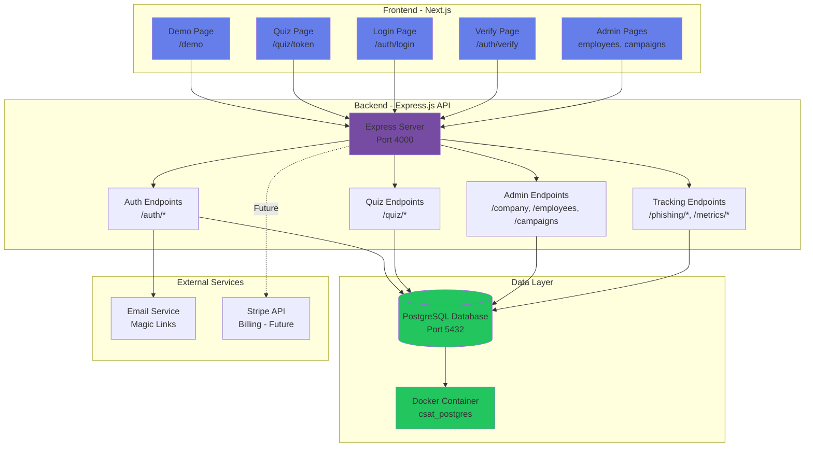
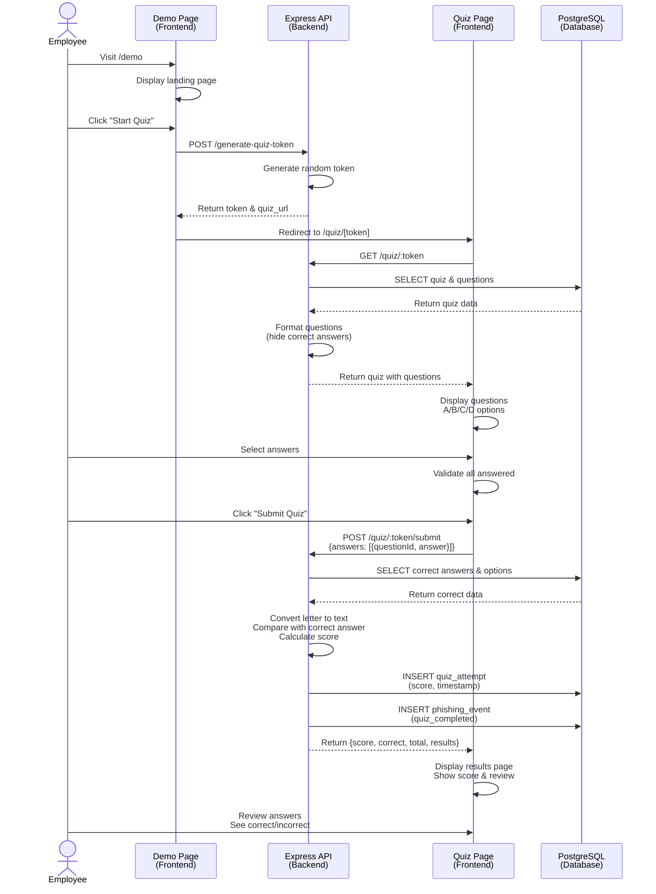
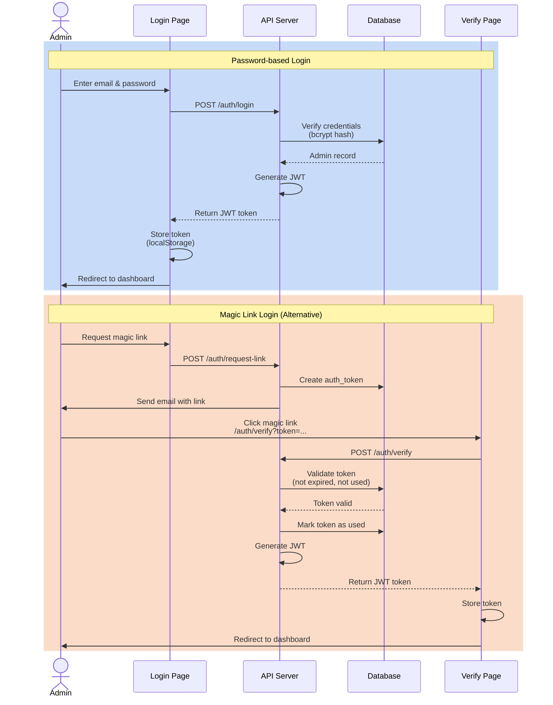
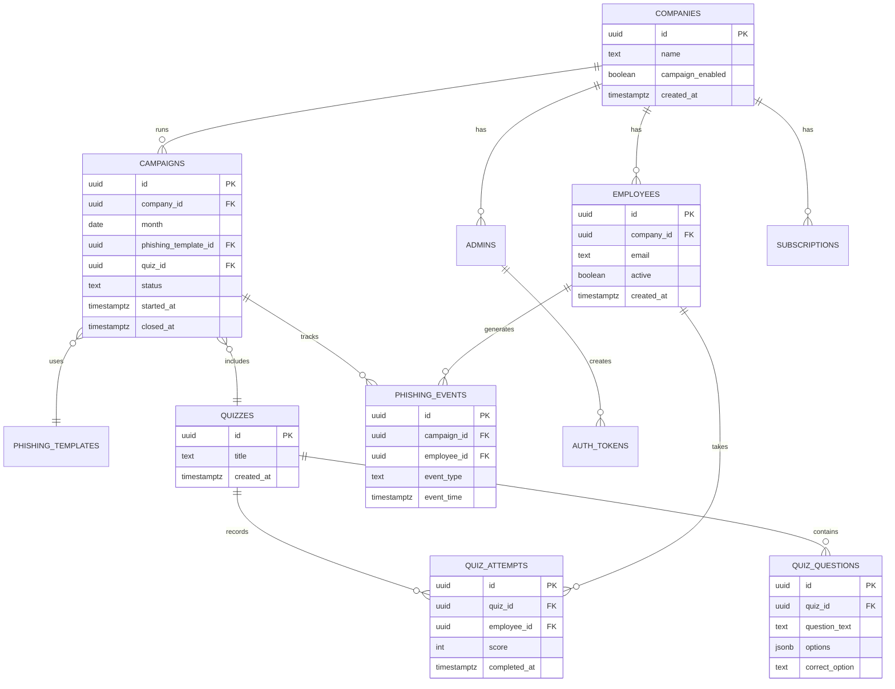
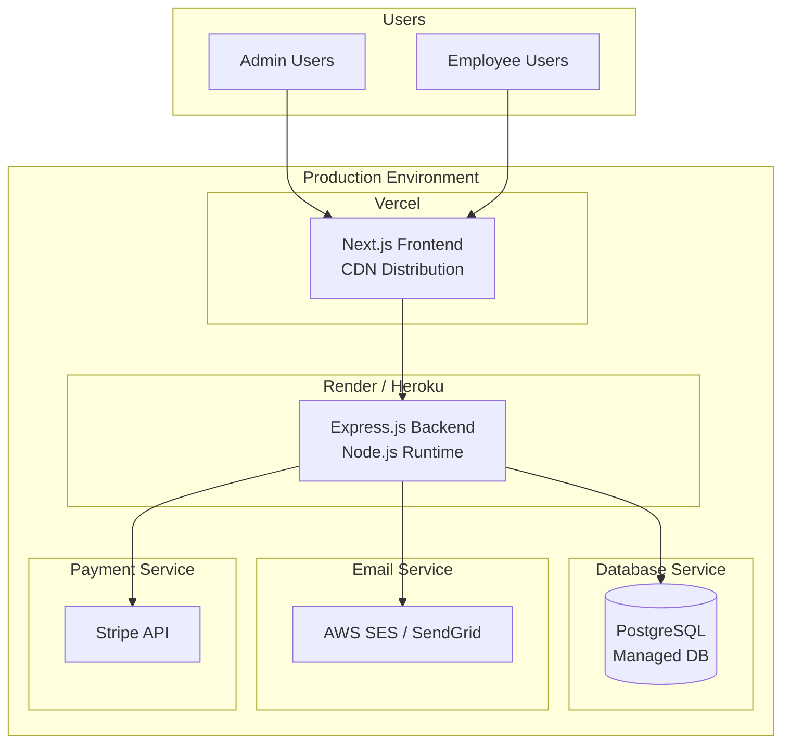

# System Architecture

## Overview
The Cybersecurity Awareness Training SaaS is built as a full-stack web application with a React-based frontend, Express.js backend, and PostgreSQL database.

## Architecture Diagram



## System Components

### Frontend (Next.js + React)
- **Technology**: Next.js 14, React, TypeScript
- **Port**: 3000
- **Key Pages**:
  - `/demo` - Landing page for quick quiz access
  - `/quiz/[token]` - Interactive quiz interface
  - `/auth/login` - Admin authentication
  - `/auth/verify` - Magic link verification
  - `/employees` - Employee management (future)
  - `/campaigns` - Campaign management (future)

### Backend (Express.js)
- **Technology**: Node.js, Express.js
- **Port**: 4000
- **Key Features**:
  - RESTful API
  - JWT authentication
  - Rate limiting
  - CORS enabled
  - PostgreSQL connection pooling

### Database (PostgreSQL)
- **Technology**: PostgreSQL 15
- **Port**: 5432
- **Deployment**: Docker container
- **Schema**: 11 tables
  - companies, admins, employees
  - campaigns, phishing_templates, phishing_events
  - quizzes, quiz_questions, quiz_attempts
  - auth_tokens, subscriptions

## End-User Quiz Flow - Sequence Diagram



## Quiz Scoring Logic Flow

```mermaid
flowchart TD
    A[Receive User Answers<br/>Letter Format: A, B, C, D] --> B[Fetch Quiz Questions<br/>from Database]
    B --> C[Get Correct Answers<br/>Text Format: 'Malicious email']
    C --> D[Get Options Array<br/>['Malicious email', 'Type of fish', ...]]
    
    D --> E{For Each Answer}
    E --> F[Convert Letter to Index<br/>A=0, B=1, C=2, D=3]
    F --> G[Get Option Text<br/>options[index]]
    G --> H{Compare:<br/>User Text == Correct Text?}
    
    H -->|Yes| I[Mark as Correct<br/>score++]
    H -->|No| J[Mark as Incorrect]
    
    I --> K[Find Correct Letter<br/>for Response]
    J --> K
    K --> L{More Answers?}
    
    L -->|Yes| E
    L -->|No| M[Calculate Percentage<br/>score/total × 100]
    M --> N[Save to Database]
    N --> O[Return Results to User]
```

## Data Flow

### Quiz Submission Data Flow
1. **Frontend** → Sends answers as `[{questionId: "uuid", answer: "A"}]`
2. **Backend** → Fetches questions with `correct_option` (text) and `options` (array)
3. **Backend** → Converts letter answer to option text using array index
4. **Backend** → Compares user's option text with correct_option text
5. **Backend** → Calculates score and formats response
6. **Backend** → Stores result in `quiz_attempts` table
7. **Frontend** → Displays score and detailed review

## Authentication Flow



## Database Schema Overview



## Technology Stack

### Frontend
- **Framework**: Next.js 14.2.35
- **Language**: TypeScript
- **Styling**: CSS-in-JS (inline styles)
- **State Management**: React Hooks (useState, useEffect)
- **Routing**: Next.js App Router

### Backend
- **Runtime**: Node.js
- **Framework**: Express.js
- **Language**: JavaScript
- **Authentication**: JWT + bcrypt
- **Database Client**: pg (node-postgres)
- **Security**: express-rate-limit, CORS

### Database
- **DBMS**: PostgreSQL 15
- **Container**: Docker (postgres:15-alpine)
- **ORM**: Raw SQL queries (no ORM)
- **Extensions**: pgcrypto (for UUID generation and password hashing)

### DevOps
- **Containerization**: Docker & Docker Compose
- **CI/CD**: GitHub Actions
- **Testing**: Jest
- **Version Control**: Git

## API Endpoints

### Authentication
- `POST /auth/login` - Email/password authentication
- `POST /auth/request-link` - Request magic link
- `POST /auth/verify` - Verify magic link token

### Quiz System
- `GET /quiz/:token` - Fetch quiz questions
- `POST /quiz/:token/submit` - Submit quiz answers
- `POST /generate-quiz-token` - Generate quiz access token

### Admin - Companies
- `POST /company` - Create company
- `GET /company` - Get company details

### Admin - Employees
- `POST /employees/import` - Bulk import via CSV
- `GET /employees` - List employees
- `PATCH /employees/:id/deactivate` - Deactivate employee

### Admin - Campaigns
- `POST /campaigns` - Create campaign
- `GET /campaigns` - List campaigns
- `GET /campaigns/:id` - Get campaign details
- `POST /campaigns/:id/start` - Start campaign
- `POST /campaigns/:id/close` - Close campaign

### Tracking & Analytics
- `GET /phishing/open/:token` - Track email opens
- `GET /phishing/click/:token` - Track link clicks
- `GET /metrics/campaign/:id` - Get campaign metrics
- `GET /reports/campaign/:id` - Get campaign report

## Security Features

1. **Authentication**
   - JWT-based token authentication
   - bcrypt password hashing
   - Magic link email verification
   - Token expiration and single-use enforcement

2. **Rate Limiting**
   - Auth endpoints: 5 requests per 15 minutes
   - Prevents brute force attacks

3. **Data Protection**
   - CORS enabled for controlled access
   - SQL injection prevention (parameterized queries)
   - Password hashes never exposed in API responses
   - Correct quiz answers hidden from client

4. **Input Validation**
   - Required field validation
   - Email format validation
   - Token length validation

## Deployment Architecture (Future)



## Performance Considerations

1. **Database Connection Pooling**
   - PostgreSQL connection pool for efficient resource usage
   - Prevents connection exhaustion

2. **Frontend Optimization**
   - Next.js automatic code splitting
   - Server-side rendering for initial load
   - Static asset optimization

3. **API Response Size**
   - Pagination for list endpoints (future)
   - Selective field return
   - JSON compression

4. **Caching Strategy** (Future)
   - Redis for session storage
   - CDN caching for static assets
   - Query result caching for reports

## Scalability

### Horizontal Scaling
- Stateless backend allows multiple server instances
- Load balancer distribution (future)
- Database read replicas for reporting (future)

### Vertical Scaling
- Increase server resources as needed
- Database performance tuning
- Connection pool size adjustment

## Monitoring & Logging (Future)

- Application performance monitoring (APM)
- Error tracking (Sentry)
- Access logs
- Database query performance monitoring
- User analytics

## Backup & Recovery (Future)

- Automated daily database backups
- Point-in-time recovery capability
- Data retention policies
- Disaster recovery plan
